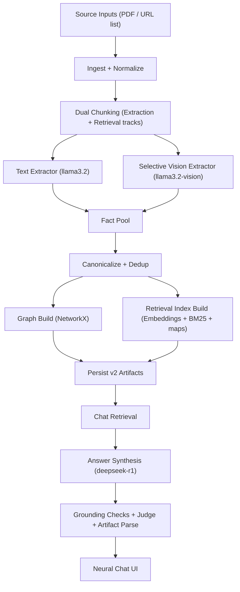

# Open GR --WM
## System Design and Technical Requirements Document (SDTRD) v2.1

**Document status:** Active, implementation-aligned  
**Audience:** Mixed (leadership, product, design, operations, engineering)  
**Last updated:** 2026-02-10  
**Scope:** Current local implementation only, no aspirational redesign assumptions

**Primary source-of-truth code:**
- `/Users/shantanurastogi/Documents/New project/app.py`
- `/Users/shantanurastogi/Documents/New project/graphrag_v2/chunking.py`
- `/Users/shantanurastogi/Documents/New project/graphrag_v2/extract_text.py`
- `/Users/shantanurastogi/Documents/New project/graphrag_v2/extract_vision.py`
- `/Users/shantanurastogi/Documents/New project/graphrag_v2/canonicalize.py`
- `/Users/shantanurastogi/Documents/New project/graphrag_v2/indexing.py`
- `/Users/shantanurastogi/Documents/New project/graphrag_v2/retrieval.py`
- `/Users/shantanurastogi/Documents/New project/graphrag_v2/evals.py`
- `/Users/shantanurastogi/Documents/New project/graphrag_v2/storage.py`

---

## 1. Executive Overview (Plain English)
Open GR --WM is a local-first GraphRAG application that converts PDFs and selected web pages into a reusable knowledge graph, then answers questions grounded in that graph and retrieved source evidence.

### What the product does
1. Ingests source content from PDF and explicit URL inputs.
2. Extracts facts from text and selected visual artifacts (charts/images/tables).
3. Builds and persists a graph workspace on local disk.
4. Retrieves evidence for user questions.
5. Produces citation-aware responses with optional visuals and hero metrics.

### Why these design choices matter
1. **Local runtime** protects sensitive document workflows.
2. **Graph persistence** avoids expensive rebuild every session.
3. **Strict grounding policy** suppresses unsupported answers.
4. **Model specialization** balances speed and answer quality.

### Core value unlocked
Users can ask high-value analytical questions against dense business documents and receive operationally useful answers with explicit evidence and repeatable data lifecycle controls.

---

## 2. System Boundaries And Constraints (Local M1 Runtime)
### Runtime boundaries
1. Inference endpoint: `http://localhost:11434/api/generate`.
2. App runtime: Streamlit (single-process event-loop style with reruns).
3. Storage root: `/Users/shantanurastogi/Documents/New project/rag_store`.
4. External cloud APIs: none required for model inference.

### Hardware and model constraints
1. Target machine class: MacBook Pro M1 (shared memory architecture).
2. Installed models expected:
- Scanner: `llama3.2:latest`
- Vision: `llama3.2-vision:latest`
- Brain: `deepseek-r1:14b`
- Embedding model: `all-MiniLM-L6-v2`
3. Small-to-mid local models require careful context and output-token budgeting.

### Product policy constraints
1. URL ingest policy is explicit URL only, depth `0` (no crawler expansion).
2. Local-only persistence and deletion are user-controlled from UI.
3. Legacy graph compatibility is non-normative and low-priority.

### UI/runtime constraints
1. Streamlit reruns can cause short visible state transitions during long operations.
2. Long-running builds require checkpointing and resumable queues to stay practical.
3. Rendering of model-produced artifacts must tolerate malformed JSON-like output.

---

## 3. Architecture Overview
### 3.1 High-level architecture


### 3.2 Component responsibilities
1. `app.py`
Coordinates UI, orchestration, model calls, build loop, session state, and rendering.
2. `graphrag_v2/chunking.py`
Implements dual-track chunk creation and profile-based token windows.
3. `graphrag_v2/extract_text.py`
Implements pass-A/pass-B extraction plus numeric boost and chunk-level cache usage.
4. `graphrag_v2/extract_vision.py`
Implements strict JSON vision fact extraction for selected artifacts.
5. `graphrag_v2/canonicalize.py`
Normalizes entities, filters null-like values, merges aliases, deduplicates facts.
6. `graphrag_v2/indexing.py`
Builds retrieval index: embeddings, BM25 tokens/model, metric/entity maps.
7. `graphrag_v2/retrieval.py`
Runs query planning, hybrid retrieval fusion, graph expansion, confidence scoring.
8. `graphrag_v2/evals.py`
Computes build quality and performance metrics plus pass/fail checks.
9. `graphrag_v2/storage.py`
Persists and loads v2 artifacts; manages SQLite extraction cache and checkpoint files.

### 3.3 Architecture-to-code traceability matrix
| Subsystem | Primary files | Key functions |
|---|---|---|
| LLM connectivity | `/Users/shantanurastogi/Documents/New project/app.py` | `call_ollama`, `call_ollama_stream`, `strip_think` |
| PDF ingest | `/Users/shantanurastogi/Documents/New project/app.py` | `read_pdf_pages`, `analyze_pdf_pages`, `prepare_vision_images` |
| URL ingest | `/Users/shantanurastogi/Documents/New project/app.py` | `normalize_source_url`, `parse_web_url_inputs`, `extract_web_content` |
| Chunking | `/Users/shantanurastogi/Documents/New project/graphrag_v2/chunking.py` | `build_chunk_tracks_for_pages`, `profile_to_chunk_params` |
| Text extraction | `/Users/shantanurastogi/Documents/New project/graphrag_v2/extract_text.py` | `extract_facts_from_text_chunk` |
| Vision extraction | `/Users/shantanurastogi/Documents/New project/graphrag_v2/extract_vision.py` | `extract_facts_from_vision_artifact` |
| Canonicalization + graph | `/Users/shantanurastogi/Documents/New project/graphrag_v2/canonicalize.py` | `canonicalize_facts`, `facts_to_graph` |
| Retrieval index | `/Users/shantanurastogi/Documents/New project/graphrag_v2/indexing.py` | `build_retrieval_index`, `dense_scores`, `sparse_scores`, `mmr_select` |
| Evidence retrieval | `/Users/shantanurastogi/Documents/New project/graphrag_v2/retrieval.py` | `build_query_plan`, `retrieve_evidence_bundle` |
| Build evals | `/Users/shantanurastogi/Documents/New project/graphrag_v2/evals.py` | `run_build_evals` |
| Persistence | `/Users/shantanurastogi/Documents/New project/graphrag_v2/storage.py` | `save_v2_artifacts`, `load_v2_artifacts`, `cache_lookup`, `cache_store`, checkpoint functions |
| Chat guardrails | `/Users/shantanurastogi/Documents/New project/app.py` | `quick_grounding_check`, `judge_answer`, artifact sanitizers |

---

## 4. End-to-End Backend Pipeline
### 4.1 Pipeline stages
1. **Ingest**
- Parse sources into normalized text/visual candidates.
- Validate URL shape and content type.
2. **Chunk**
- Build extraction and retrieval chunk tracks with profile-based token parameters.
3. **Extract**
- Run text pass A + pass B extraction.
- Run vision extraction only for selected artifacts.
- Cache extraction responses by deterministic keys.
4. **Canonicalize**
- Clean entities, merge aliases, remove null-like nodes, dedup with provenance aggregation.
5. **Graph and index build**
- Build `NetworkX MultiDiGraph`.
- Build retrieval index (embeddings + BM25 + metric/entity maps).
6. **Persist**
- Save v2 artifacts and root metadata.
- Save periodic checkpoint while building.
7. **Retrieve and answer**
- Create evidence bundle.
- Enforce confidence gate.
- Generate answer and run groundedness checks.
- Parse visual artifacts and hero figures.

### 4.2 Key runtime constants (implementation-aligned)
1. Models:
- Scanner: `llama3.2:latest`
- Vision: `llama3.2-vision:latest`
- Brain: `deepseek-r1:14b`
2. Default chat retrieval top-k: `8`.
3. Low-confidence gate: `retrieval_confidence < 0.22` and `<2 chunk citations` and no graph context.
4. Build batch size by profile key:
- `fast -> 6 tasks/tick`
- `balanced -> 4 tasks/tick`
- `quality -> 3 tasks/tick`
5. Checkpoint cadence: every `20` processed tasks (or completion).

### 4.3 Build profile behavior in orchestration
1. `Fast`
- Text batching: `max_pages_per_batch=4`, `max_chars=2600`, `min_text_chars=120`
- Vision detail default: `1.3`
2. `Balanced`
- Text batching: `3`, `3000`, `80`
- Vision detail default: `1.6`
3. `Thorough`
- Text batching: `2`, `3600`, `60`
- Vision detail default: `1.8`

### 4.4 Why this staged pipeline was chosen
1. Separates concerns for maintainability and instrumentation.
2. Keeps speed-critical extraction decoupled from quality-critical answer synthesis.
3. Allows per-stage fallback and partial recovery.
4. Keeps all artifacts inspectable and auditable on disk.

---

## 5. Ingestion Design (PDF + URL depth 0)
### 5.1 PDF ingestion
- Reads page text via `PyPDF2` and stores page list in session.
- Computes page image/text metadata:
  - image-page detection via `/XObject` scanning.
  - per-page text length.
- Uses these signals for vision routing.

### 5.2 URL ingestion (depth 0)
- URL normalization:
  - forces scheme when missing (`https://`).
  - strips fragments.
  - validates host presence.
- Fetch behavior:
  - user-agent set.
  - timeout guarded.
  - supports redirects.
- HTML parsing strategy:
  - remove low-value tags (`script/style/nav/...`).
  - collect title, meta description, headings, paragraphs, list/table text.
  - segment text with min/max char constraints.

### 5.3 URL visual artifact selection
- Candidate scoring considers:
  - chart/table/financial keyword presence.
  - icon/logo penalties.
  - image dimensions and SVG penalty.
- Fetches top ranked image candidates under cap (`max_vision_pages` slider).
- Encodes selected images to base64 for vision extractor.

### 5.4 Rationale and tradeoffs
1. **Rationale:** strict URL scope and heuristic filtering keep latency predictable.
2. **Tradeoff:** may miss useful low-scored images on some pages.
3. **Mitigation:** user-configurable artifact cap and optional build mode tuning.

---

## 6. Chunking Design (Dual-track strategy)
### 6.1 Design intent
Use smaller chunks for extraction precision and larger chunks for retrieval context quality.

### 6.2 Implementation details
- Section-aware splitting via `split_sections`.
- Word-span chunking preserves character offsets.
- Two tracks per source segment:
  - extraction chunks (`ex-*` IDs)
  - retrieval chunks (`re-*` IDs)

### 6.3 Profile-based token windows
From `profile_to_chunk_params`:
1. `fast`: extraction `190/24`, retrieval `330/46`
2. `balanced`: extraction `220/30`, retrieval `400/56`
3. `quality`: extraction `250/36`, retrieval `470/68`

(values are `target_tokens/overlap_tokens`)

### 6.4 Metadata guarantees per chunk
Each `ChunkRecord` includes:
- `source_id`
- `page_or_doc_idx`
- `chunk_id`
- `section_title`
- `char_start`, `char_end`
- `is_vision`
- `created_at`
- `text`

### 6.5 Rationale and tradeoffs
1. **Rationale:** decouples extraction density goals from retrieval recall goals.
2. **Tradeoff:** more storage and index-building overhead than single-track chunking.
3. **Mitigation:** profile controls and aggressive dedup/caching downstream.

---

## 7. Extraction Design (Text pass A/B + Vision selective routing)
### 7.1 Text extraction design
`extract_facts_from_text_chunk` uses two LLM passes plus rule boost:

1. **Pass A**
- prompt asks for dense facts + entities in strict JSON.
- budgets by profile:
  - fast `num_predict=180`
  - balanced `220`
  - quality `260`

2. **Pass B (densification)**
- runs only when entity count is sufficient.
- uses pass-A seeds and entity list.
- budgets by profile:
  - fast `100`
  - balanced `120`
  - quality `150`

3. **Numeric boost heuristic**
- regex extracts financial metric sentences and constructs structured facts.
- raises density for investor/financial docs where raw relation extraction can underperform.

### 7.2 Vision extraction design
`extract_facts_from_vision_artifact`:
- strict JSON fact schema.
- profile budgets:
  - fast `num_predict=220`
  - balanced `270`
  - quality `320`
- source refs encoded as `[Vision <chunk_id>]`.

### 7.3 Caching strategy
- Text and vision calls are cached in `extract_cache.sqlite` keyed by deterministic hashes over model + prompt (+ chunk id for vision).
- Cache read before call; write after call.

### 7.4 Decision rationale
1. Two-pass extraction increases relation density and robustness.
2. Numeric boost offsets weak numeric recall from local models.
3. Strict JSON format limits parser ambiguity and speeds post-processing.

### 7.5 Tradeoffs
1. More passes increase extraction latency.
2. Heuristic numeric boost can duplicate semantically equivalent facts.
3. Vision extraction remains expensive relative to text extraction.

### 7.6 Mitigations
1. Canonicalization + dedup collapse duplicates.
2. Vision routing and cap controls bound runtime.
3. Cache and checkpoints reduce rework cost.

---

## 8. Canonicalization And Graph Construction
### 8.1 Canonicalization goals
1. Remove noisy/null entities.
2. Merge aliases and near-duplicates.
3. Aggregate provenance and confidence.
4. Produce clean graph nodes and relations.

### 8.2 Rules and mechanics
- Null-like filter: `"", none, null, n/a, na, unknown, -, --`.
- Entity key normalization strips punctuation/noise while preserving finance symbols.
- Alias merge via `rapidfuzz` token-sort ratio threshold `92` (fallback exact-ish match when unavailable).
- Dedup key combines subject/predicate/object + timeframe + value + unit.
- Aggregates up to 8 source refs per deduped fact and averages confidence.

### 8.3 Graph build semantics
- Graph type: `networkx.MultiDiGraph`.
- Edge payload includes:
  - `label`
  - `value`
  - `unit`
  - `timeframe`
  - `source_ref`
  - `confidence`

### 8.4 Rationale and tradeoffs
1. **Rationale:** noisy nodes (e.g., `None`) directly degrade retrieval and answer trust.
2. **Tradeoff:** aggressive merge thresholds can over-collapse semantically distinct entities.
3. **Mitigation:** conservative threshold (`92`) + provenance retention.

---

## 9. Retrieval System Design (Dense + BM25 + graph expansion + MMR)
### 9.1 Retrieval index composition
`RetrievalIndex` includes:
- `chunk_records`
- `chunk_texts`
- `embeddings`
- `bm25_tokens`
- `bm25_model`
- `metric_map`
- `entity_map`

### 9.2 Query planning
`build_query_plan` derives:
1. intents (`trend_or_compare`, `guidance_lookup`, `driver_analysis`, `direct_lookup`)
2. timeframe signals (years, FY terms, quarters)
3. entity hits (from graph-node overlap scoring)
4. metric hits (fixed finance lexicon)

### 9.3 Candidate generation and fusion
1. Dense top candidates from cosine similarities.
2. Sparse top candidates from BM25.
3. Prior candidates from entity/metric maps.
4. Weighted blend:
- dense normalized contribution `0.56`
- sparse normalized contribution `0.34`
- entity/metric/prior bonus capped at `0.20`
5. MMR selection uses `lambda_mult=0.72`.

### 9.4 Graph context expansion
- Expands from seed entities to out/in edges with cap (`max_edges` ~110 for retrieval path).
- Adds `[Graph]` citation when graph context is included.

### 9.5 Confidence computation
Confidence is average of:
1. blended score mean over selected chunks
2. entity hit coverage
3. selected chunk count ratio
4. citation diversity ratio

### 9.6 Rationale and tradeoffs
1. **Rationale:** hybrid retrieval improves recall on mixed lexical/semantic queries.
2. **Tradeoff:** more components increase tuning and debugging complexity.
3. **Mitigation:** expose debug fields in evidence bundle and eval proxies.

---

## 10. Grounding And Answer Governance (confidence gate + judge)
### 10.1 Prompt and context governance
- Answer prompt includes:
  - allowed citations list
  - retrieval confidence
  - visual and hero block formatting constraints
  - explicit instruction to say not-found when unsupported

### 10.2 Hard low-confidence gate
Before answer generation:
- if `confidence < 0.22` and `<2 chunk citations` and no graph context,
- pipeline returns deterministic not-found path.

### 10.3 Streaming and continuation policy
- Primary answer via `call_ollama_stream` with:
  - timeout `720`
  - options `{temperature: 0.1, num_predict: 2200, num_ctx: 8192}`
- Continuation triggered on likely truncation (`done_reason=length` or trailing incomplete form).

### 10.4 Grounding checks sequence
1. Rule check (`quick_grounding_check`):
- citation presence/validity
- numbers without citation detection
- graph citation logic
2. Judge check (`judge_answer` with scanner model):
- strict JSON verdict (`pass|retry|not_found`)
- budget tuned for speed (`timeout=35`, `num_predict=90`)
3. Retry path once (brain model) if `retry`.
4. Fallback to not-found when unresolved.

### 10.5 Artifact hygiene and parsing
- Strips `<think>...</think>` from display payload.
- Extracts and sanitizes `<visualization>{...}</visualization>` and `<hero_figures>[...]</hero_figures>`.
- Removes residual malformed JSON blocks from visible answer body.

### 10.6 Rationale and tradeoffs
1. **Rationale:** groundedness checks reduce hallucination risk in local model setup.
2. **Tradeoff:** strict gating can produce more not-found outcomes.
3. **Mitigation:** retrieval fusion, graph expansion, and augmentation workflows improve evidence availability.

---

## 11. Persistence Architecture (v2 artifacts + cache + checkpoint)
### 11.1 Storage topology
For each graph ID `<rag_id>`:

```text
rag_store/
  <rag_id>/
    meta.json
    v2/
      manifest.json
      graph.json
      facts.jsonl
      entities.jsonl
      chunks.jsonl
      embeddings.npy
      bm25_index.pkl
      eval_report.json
      extract_cache.sqlite
      build_checkpoint.json   # transient during in-progress/paused builds
```

### 11.2 Artifact responsibilities
1. `manifest.json`: authoritative v2 metadata (`format_version=2.0`, counts, models, timings, quality metrics).
2. `graph.json`: node-link serialized `MultiDiGraph`.
3. `facts.jsonl`: canonical fact records.
4. `chunks.jsonl`: extraction and retrieval chunk records.
5. `embeddings.npy`: retrieval vectors.
6. `bm25_index.pkl`: BM25 token payload + entity/metric maps.
7. `extract_cache.sqlite`: LLM extraction cache.
8. `build_checkpoint.json`: resumability marker.

### 11.3 Root metadata role (`meta.json`)
- quick listing and UX fields (name, timestamps, counts, disk size proxies via scan).
- source lineage summary (`source_files`, counts, last source metadata).

### 11.4 Import/export contract
- Export requires mandatory files:
  - `meta.json`
  - `v2/manifest.json`
  - `v2/graph.json`
  - `v2/facts.jsonl`
  - `v2/chunks.jsonl`
  - `v2/embeddings.npy`
- Import validates archive path safety and required files before activation.

### 11.5 Typed data/interface contracts
#### 11.5.1 `Fact` contract
```json
{
  "subject": "string",
  "predicate": "string",
  "object": "string",
  "value": "string",
  "unit": "string",
  "timeframe": "string",
  "source_ref": "string",
  "confidence": 0.0,
  "source_id": "string",
  "chunk_id": "string"
}
```

#### 11.5.2 `ChunkRecord` contract
```json
{
  "source_id": "string",
  "page_or_doc_idx": 0,
  "chunk_id": "string",
  "section_title": "string",
  "char_start": 0,
  "char_end": 0,
  "is_vision": false,
  "created_at": "ISO-8601",
  "text": "string"
}
```

#### 11.5.3 `RetrievalEvidence` contract
```json
{
  "chunk_ids": [0, 1],
  "chunk_lines": ["[Chunk ...] ..."],
  "graph_lines": ["A -[predicate]-> B [Chunk ...]"],
  "confidence": 0.0,
  "entity_hits": ["string"],
  "metric_hits": ["string"],
  "allowed_citations": ["[Graph]", "[Chunk ...]"],
  "debug": {"selected": 8.0}
}
```

#### 11.5.4 `QueryPlan` contract
```json
{
  "intents": ["direct_lookup"],
  "timeframe": "unspecified",
  "entities": ["entity-a"],
  "metrics": ["revenue"]
}
```

#### 11.5.5 `RetrievalIndex` contract (runtime object)
```text
RetrievalIndex
  chunk_records: List[ChunkRecord]
  chunk_texts: List[str]
  embeddings: np.ndarray
  bm25_tokens: List[List[str]]
  bm25_model: BM25Okapi | None
  metric_map: Dict[str, List[int]]
  entity_map: Dict[str, List[int]]
```

#### 11.5.6 `manifest.json` contract (v2)
Required top-level keys:
1. `format_version` (`\"2.0\"`)
2. `rag_id`
3. `graph_name`
4. `created_at`
5. `updated_at`
6. `build_profile`
7. `models` (`scanner`, `vision`, `brain`, `embed`)
8. `source_files`
9. `timings`
10. `quality_metrics`
11. `counts` (`nodes`, `edges`, `facts`, `retrieval_chunks`, `extraction_chunks`)

#### 11.5.7 `eval_report.json` contract
```json
{
  "summary": {
    "nodes": 0,
    "edges": 0,
    "facts": 0,
    "retrieval_chunks": 0,
    "pages": 0
  },
  "quality_metrics": {
    "edges_per_page": 0.0,
    "none_node_rate": 0.0,
    "citation_validity_rate": 0.0,
    "numeric_support_rate": 0.0,
    "retrieval_recall_at_8_proxy": 0.0
  },
  "performance_metrics": {
    "build_total_sec": 0.0,
    "extract_sec": 0.0,
    "facts_per_sec": 0.0
  },
  "checks": {
    "edges_per_page>=6": true,
    "none_node_rate==0": true,
    "citation_validity>=0.95": true,
    "retrieval_recall@8_proxy>=0.85": true
  },
  "pass": true
}
```

#### 11.5.8 `extract_cache.sqlite` contract
Table: `extract_cache`
1. `cache_key TEXT PRIMARY KEY`
2. `value TEXT NOT NULL`
3. `updated_at TEXT NOT NULL`

#### 11.5.9 `build_checkpoint.json` contract
```json
{
  "build_index": 120,
  "build_total": 360,
  "facts_count": 1420,
  "profile": "balanced",
  "updated_at": "ISO-8601"
}
```

#### 11.5.10 `chat_sessions.json` contract
```json
[
  {
    "id": "uuid",
    "title": "string",
    "created_at": "ISO-8601",
    "updated_at": "ISO-8601",
    "messages": [
      {
        "role": "user|assistant",
        "content": "string",
        "viz": {},
        "hero_figures": [],
        "thinking": "string"
      }
    ]
  }
]
```

#### 11.5.11 Import/export required file contract
Minimal archive validity set:
1. `meta.json`
2. `v2/manifest.json`
3. `v2/graph.json`
4. `v2/facts.jsonl`
5. `v2/chunks.jsonl`
6. `v2/embeddings.npy`

### 11.6 Rationale and tradeoffs
1. **Rationale:** explicit artifactization improves reproducibility, portability, and operational control.
2. **Tradeoff:** additional file count and storage overhead.
3. **Mitigation:** lifecycle controls (`Unload`, `Delete Disk`, archive export).

---

## 12. Session And Chat History Persistence
### 12.1 Persistence model
- Chat sessions stored in: `/Users/shantanurastogi/Documents/New project/rag_store/chat_sessions.json`.
- Session structure includes:
  - `id`, `title`, `created_at`, `updated_at`, `messages[]`.

### 12.2 Message payload model
Each assistant message may include:
- `content`
- `viz` object
- `hero_figures` list
- `thinking` trace (truncated for safety)
- enrichment summaries

### 12.3 Session operations
1. Create new session.
2. Switch active session.
3. Delete one session with fallback auto-create when last session removed.
4. Persist active session on each mutation.

### 12.4 Rationale and tradeoffs
1. **Rationale:** multi-threaded analytical workflows need separable chat memory.
2. **Tradeoff:** single JSON file can become large over time.
3. **Mitigation:** compact sidebar UX with per-session delete controls.

---

## 13. Operational Controls And Build Lifecycle
### 13.1 User controls mapped to backend actions
1. `Build` or `Augment`
- seeds task queue, resets runtime flags, prepares source metadata.
2. `Stop`
- sets stop flag and pauses loop safely.
3. `Clear RAM`
- clears loaded graph and runtime state without disk deletion.
4. `Load/Unload/Delete`
- manages in-memory vs on-disk lifecycle independently.
5. `Import/Export`
- enables long-term workspace transfer and backup.

### 13.2 Build loop mechanics
- Build queue contains text chunk tasks and vision artifact tasks.
- Per-rerun processing count depends on profile key.
- Checkpoint updates every 20 tasks.
- On completion:
  - canonicalize
  - graph build
  - retrieval index build
  - eval report
  - auto-save artifacts

### 13.3 Observability surfaces
1. progress bar (`build_index/build_total`)
2. throughput and ETA (`tasks/s`)
3. rolling logs (terminal style)
4. ephemeral status bubbles

---

## 14. Performance Design For M1 (budgets, bottlenecks, tuning levers)
### 14.1 Dominant bottlenecks
1. LLM extraction latency (especially vision tasks).
2. embedding computation on large chunk sets.
3. Streamlit rerun overhead when queues are large.
4. answer generation under large context windows.

### 14.2 Tuning levers currently exposed
1. Build mode (`Fast/Balanced/Thorough`).
2. Vision routing toggle.
3. Vision text limit threshold.
4. Max vision artifacts per source.
5. Vision detail scale.

### 14.3 Internal throughput stabilizers
1. extraction cache in SQLite.
2. profile-based task batch count per tick.
3. checkpoint and resumability support.
4. deterministic enrichment (no enrichment LLM latency spikes).

### 14.4 Practical quality-speed tradeoff posture
1. `Fast`: lowest latency, lower relation density potential.
2. `Balanced`: default operating point.
3. `Thorough`: higher extraction density, slower pipeline.

### 14.5 Non-functional requirement envelope
1. Maintain interactive responsiveness during long builds via logs/progress and stop control.
2. Prefer deterministic not-found over speculative answer under low confidence.
3. Keep all operations local and resumable.

---

## 15. Error Handling And Recovery Paths
### 15.1 Ingestion errors
1. invalid URL or unsupported content type -> user error message and safe abort.
2. unreadable PDF or empty page extraction -> warning and stop before queue build.

### 15.2 Build errors
1. zero generated tasks -> warning and graceful termination.
2. stop flag -> controlled pause with preserved progress.
3. extraction call failures -> error strings captured; pipeline continues where possible.

### 15.3 Retrieval and answer errors
1. missing graph in memory -> block question and prompt load/build.
2. low confidence -> deterministic not-found.
3. judge/retry unresolved -> deterministic not-found.
4. malformed artifact payload -> sanitizer fallback; avoid raw JSON leakage when possible.

### 15.4 Visualization and graph-render errors
1. PyVis render exceptions caught with warning fallback.
2. chart parse failures fallback to table/caption/no-op.
3. hero-figure parse failures fallback to caption.

---

## 16. Security/Privacy Posture (local-first)
### 16.1 Security decisions
1. model inference remains local through Ollama.
2. import path traversal guarded during archive extraction.
3. delete actions are explicit and user-driven.

### 16.2 Privacy posture
1. source files and chat records remain local artifacts.
2. no external SaaS dependency is required for core operation.
3. operator machine security is the primary trust boundary.

### 16.3 Constraints and implications
1. no multi-user segregation or role-based controls in current scope.
2. users must manage disk hygiene for retained artifacts.

---

## 17. Design Decision Register (DD-IDs)
Each decision follows: Decision, Context, Options, Chosen, Rationale, Constraints, Tradeoffs, Mitigations, Unlock, Code trace.

### DD-001 Model specialization
- **Decision:** separate scanner, vision, and brain model roles.
- **Context/Problem:** single-model flows were too slow and unstable for both extraction and reasoning.
- **Options considered:**
1. one-model-for-all
2. two-model split (extract + answer)
3. three-model specialization
- **Chosen option:** three-model specialization.
- **Rationale:** maximizes throughput on extraction while preserving reasoning quality for final answer.
- **Constraints:** requires all local models installed.
- **Tradeoffs:** orchestration complexity increases.
- **Mitigations:** strict role separation and typed pipeline boundaries.
- **Unlock:** faster graph builds with stronger answer quality.
- **Code trace:** `/Users/shantanurastogi/Documents/New project/app.py` (`SCANNER_MODEL`, `VISION_MODEL`, `BRAIN_MODEL`).

### DD-002 Deterministic enrichment over LLM enrichment
- **Decision:** use deterministic enrichment rules (`enrich_question`) instead of LLM enrichment.
- **Context/Problem:** enrichment latency spikes and timeout variability degraded UX.
- **Options considered:**
1. always LLM enrichment
2. deterministic-only
3. hybrid with timeout fallback
- **Chosen option:** deterministic-only.
- **Rationale:** immediate and predictable query planning.
- **Constraints:** reduced nuance in enrichment output.
- **Tradeoffs:** less expressive than LLM planning.
- **Mitigations:** retrieval fusion and intent heuristics.
- **Unlock:** stable low-latency chat turn startup.
- **Code trace:** `/Users/shantanurastogi/Documents/New project/app.py` (`build_deterministic_enrichment`, `enrich_question`).

### DD-003 Strict grounded not-found policy
- **Decision:** enforce not-found when evidence support is weak.
- **Context/Problem:** hallucinated responses reduce trust.
- **Options considered:**
1. always answer best effort
2. confidence-gated not-found
3. user-selectable strictness modes
- **Chosen option:** confidence-gated not-found.
- **Rationale:** prioritize trust over superficial answer coverage.
- **Constraints:** more visible not-found outcomes.
- **Tradeoffs:** perceived recall may drop.
- **Mitigations:** better retrieval fusion and augmentation workflow.
- **Unlock:** higher confidence in answer reliability.
- **Code trace:** `/Users/shantanurastogi/Documents/New project/app.py` (`low_confidence_gate`, `quick_grounding_check`).

### DD-004 Two-pass text extraction
- **Decision:** implement pass A extraction + pass B densification.
- **Context/Problem:** single-pass extraction produced sparse relations.
- **Options considered:**
1. single-pass
2. two-pass
3. multi-pass iterative extraction
- **Chosen option:** two-pass.
- **Rationale:** best quality gain per latency cost.
- **Constraints:** increases per-chunk runtime.
- **Tradeoffs:** more model calls.
- **Mitigations:** cache each pass output.
- **Unlock:** denser graph facts.
- **Code trace:** `/Users/shantanurastogi/Documents/New project/graphrag_v2/extract_text.py`.

### DD-005 Numeric boost heuristic
- **Decision:** add regex-based numeric fact boost.
- **Context/Problem:** local extraction models under-capture KPI lines in financial text.
- **Options considered:**
1. model-only extraction
2. model + deterministic numeric boost
3. external parser stack
- **Chosen option:** model + deterministic boost.
- **Rationale:** pragmatic density improvement without external services.
- **Constraints:** can produce near-duplicate facts.
- **Tradeoffs:** heuristic maintenance burden.
- **Mitigations:** canonical dedup and provenance merge.
- **Unlock:** stronger retrieval for metric-heavy queries.
- **Code trace:** `/Users/shantanurastogi/Documents/New project/graphrag_v2/extract_text.py` (`_numeric_boost_facts`).

### DD-006 Selective vision routing with caps
- **Decision:** route only candidate pages/artifacts to vision model.
- **Context/Problem:** full-vision processing is too slow locally.
- **Options considered:**
1. vision on all pages/artifacts
2. selective heuristics + cap
3. vision disabled by default always
- **Chosen option:** selective heuristics + cap.
- **Rationale:** best latency-quality balance for mixed documents.
- **Constraints:** heuristic misses possible.
- **Tradeoffs:** some visual facts may be skipped.
- **Mitigations:** user controls for threshold, cap, scale.
- **Unlock:** practical build times with visual coverage.
- **Code trace:** `/Users/shantanurastogi/Documents/New project/app.py` (`select_vision_pages`, `extract_web_content` image scoring).

### DD-007 Dual-track chunking by profile
- **Decision:** separate chunk shapes for extraction vs retrieval by profile.
- **Context/Problem:** one-size chunking hurt either extraction precision or retrieval recall.
- **Options considered:**
1. single chunk profile
2. dual-track profiles
3. per-query dynamic re-chunking
- **Chosen option:** dual-track profiles.
- **Rationale:** stable quality improvements with manageable complexity.
- **Constraints:** larger persistent metadata.
- **Tradeoffs:** extra implementation and storage overhead.
- **Mitigations:** clear chunk record schema and profile presets.
- **Unlock:** better extraction and retrieval quality simultaneously.
- **Code trace:** `/Users/shantanurastogi/Documents/New project/graphrag_v2/chunking.py`.

### DD-008 Hybrid retrieval fusion and MMR
- **Decision:** blend dense, sparse, and priors; then MMR select.
- **Context/Problem:** pure dense or pure lexical retrieval had recall gaps.
- **Options considered:**
1. dense-only
2. lexical-only
3. hybrid with reranking
- **Chosen option:** hybrid with MMR.
- **Rationale:** improves coverage and reduces redundant context.
- **Constraints:** tuning complexity.
- **Tradeoffs:** more retrieval-stage compute.
- **Mitigations:** capped candidate sizes and lightweight blending.
- **Unlock:** higher evidence coverage for complex queries.
- **Code trace:** `/Users/shantanurastogi/Documents/New project/graphrag_v2/retrieval.py`.

### DD-009 Judge strategy with retry
- **Decision:** lightweight scanner-model judge validates answer support.
- **Context/Problem:** final answer model can still drift under long context.
- **Options considered:**
1. no judge
2. rule checks only
3. rule checks + lightweight LLM judge + retry
- **Chosen option:** rule checks + judge + retry once.
- **Rationale:** practical quality guardrail on local hardware.
- **Constraints:** judge false positives/negatives possible.
- **Tradeoffs:** extra latency for judged turns.
- **Mitigations:** small judge budget and strict fallback to not-found.
- **Unlock:** better groundedness consistency.
- **Code trace:** `/Users/shantanurastogi/Documents/New project/app.py` (`judge_answer`, retry branch).

### DD-010 v2 artifactized storage contract
- **Decision:** store graph workspace as explicit v2 artifact set.
- **Context/Problem:** in-memory-only systems lose expensive build output.
- **Options considered:**
1. in-memory only
2. monolithic blob file
3. explicit versioned artifact set
- **Chosen option:** explicit versioned artifact set.
- **Rationale:** inspectability, portability, deterministic load behavior.
- **Constraints:** file management complexity.
- **Tradeoffs:** more disk footprint and artifact handling code.
- **Mitigations:** graph operations UI (load/unload/export/import/delete).
- **Unlock:** long-lived reusable graph workspaces.
- **Code trace:** `/Users/shantanurastogi/Documents/New project/graphrag_v2/storage.py`.

### DD-011 Extraction cache and checkpoint strategy
- **Decision:** persist cache and checkpoint state per graph workspace.
- **Context/Problem:** rebuild interruptions and repeated extraction wasted time.
- **Options considered:**
1. no cache/checkpoint
2. memory-only cache
3. disk-backed cache + checkpoint
- **Chosen option:** disk-backed cache + checkpoint.
- **Rationale:** crucial for local reliability and iterative augmentation.
- **Constraints:** stale-cache risk when prompts change.
- **Tradeoffs:** cache invalidation complexity.
- **Mitigations:** cache key includes model/prompt signature.
- **Unlock:** resumability and lower repeated build cost.
- **Code trace:** `/Users/shantanurastogi/Documents/New project/graphrag_v2/storage.py` (`extract_cache.sqlite`, checkpoint functions).

### DD-012 Archive import/export model
- **Decision:** zip-based archive format with strict required-file validation.
- **Context/Problem:** users need backup/migration across sessions/machines.
- **Options considered:**
1. no archive support
2. export/import raw folder manually
3. managed archive workflow
- **Chosen option:** managed archive workflow.
- **Rationale:** safer portability with validation.
- **Constraints:** import rejects malformed archives.
- **Tradeoffs:** stricter format means lower tolerance for partial backups.
- **Mitigations:** explicit required-file checks and clear error feedback.
- **Unlock:** reliable workspace portability.
- **Code trace:** `/Users/shantanurastogi/Documents/New project/app.py` (`export_rag_archive`, `import_rag_archive`).

### DD-013 Streamlit rerun state orchestration
- **Decision:** queue-driven incremental build via session state and reruns.
- **Context/Problem:** Streamlit is rerun-based, not long-running task daemon.
- **Options considered:**
1. synchronous blocking build in one call
2. external worker process
3. rerun-state queue processing
- **Chosen option:** rerun-state queue processing.
- **Rationale:** aligns with current app architecture and deployment simplicity.
- **Constraints:** brief UI jitter during reruns.
- **Tradeoffs:** state management complexity.
- **Mitigations:** status bubbles, activity logs, checkpoints.
- **Unlock:** controllable long build workflows in pure Streamlit runtime.
- **Code trace:** `/Users/shantanurastogi/Documents/New project/app.py` build loop around task queue and `do_rerun()`.

---

## 18. Technical Requirements (TR-IDs)
Each TR entry includes: Functional statement, Why, Inputs/Outputs, Failure mode, Metrics/threshold, Code trace.

### 18.1 `TR-ING-*` Ingestion
| TR-ID | Functional statement | Why | Inputs / Outputs | Failure mode | Metric / threshold | Code trace |
|---|---|---|---|---|---|---|
| `TR-ING-001` | System shall support PDF and URL source modes. | Multi-source graph construction. | in: mode + source; out: normalized source payload. | mode mismatch causes invalid build path. | mode always selected before build. | `/Users/shantanurastogi/Documents/New project/app.py` source module |
| `TR-ING-002` | URL ingest shall be depth-0 only over explicit URL list. | Predictable runtime and data scope. | in: primary + batch URLs; out: deduped URL list. | unintended crawl beyond list. | zero auto-discovery beyond explicit URLs. | `/Users/shantanurastogi/Documents/New project/app.py` (`parse_web_url_inputs`) |
| `TR-ING-003` | URL content shall be validated for HTML/XHTML type before extraction. | Prevent unsupported parse paths. | in: HTTP response; out: parseable HTML or error. | binary/non-html content slips through. | reject non-html content-types. | `/Users/shantanurastogi/Documents/New project/app.py` (`extract_web_content`) |
| `TR-ING-004` | PDF pages shall be extracted page-wise and analyzed for image/text signals. | Enable page-level vision routing. | in: PDF bytes; out: page_texts + image_pages + text_lengths. | empty page extraction not handled. | warn/block if total pages or valid text unavailable. | `/Users/shantanurastogi/Documents/New project/app.py` |

### 18.2 `TR-CHK-*` Chunking
| TR-ID | Functional statement | Why | Inputs / Outputs | Failure mode | Metric / threshold | Code trace |
|---|---|---|---|---|---|---|
| `TR-CHK-001` | Chunking shall create extraction and retrieval tracks. | Separate precision and recall objectives. | in: page text; out: `ChunkRecord` lists. | single-track fallback degrades quality. | both tracks present for non-empty pages. | `/Users/shantanurastogi/Documents/New project/graphrag_v2/chunking.py` |
| `TR-CHK-002` | Chunk IDs shall be deterministic and include track/page/index hash components. | Traceability and dedup stability. | in: source+text; out: stable chunk_id. | collisions across chunks. | hash suffix plus positional fields. | `/Users/shantanurastogi/Documents/New project/graphrag_v2/chunking.py` (`_make_chunk_id`) |
| `TR-CHK-003` | Chunk windows shall vary by build profile. | Quality-speed tunability. | in: profile; out: token params. | wrong profile mapping. | params match fast/balanced/quality map. | `/Users/shantanurastogi/Documents/New project/graphrag_v2/chunking.py` |

### 18.3 `TR-EXT-*` Text/Vision extraction
| TR-ID | Functional statement | Why | Inputs / Outputs | Failure mode | Metric / threshold | Code trace |
|---|---|---|---|---|---|---|
| `TR-EXT-001` | Text extraction shall run pass A and conditional pass B. | Higher relation density. | in: chunk; out: fact list. | sparse facts when pass B skipped incorrectly. | pass B executes when entity count >=2. | `/Users/shantanurastogi/Documents/New project/graphrag_v2/extract_text.py` |
| `TR-EXT-002` | Numeric boost heuristic shall augment metric-bearing sentences. | Improve KPI coverage. | in: chunk text; out: boosted facts. | numeric facts omitted. | up to 6 boost facts/chunk. | `/Users/shantanurastogi/Documents/New project/graphrag_v2/extract_text.py` |
| `TR-EXT-003` | Vision extraction shall process only routed artifacts. | Control latency. | in: artifact b64; out: fact list. | full-page vision overload. | bounded by `max_vision_pages`. | `/Users/shantanurastogi/Documents/New project/app.py`, `/Users/shantanurastogi/Documents/New project/graphrag_v2/extract_vision.py` |
| `TR-EXT-004` | Extraction calls shall use deterministic cache lookups. | Reduce repeated LLM cost. | in: prompt signature; out: cached/raw response. | cache misses due to unstable keys. | cache key includes model+prompt signature. | `/Users/shantanurastogi/Documents/New project/graphrag_v2/storage.py` |

### 18.4 `TR-GRF-*` Graph construction/canonicalization
| TR-ID | Functional statement | Why | Inputs / Outputs | Failure mode | Metric / threshold | Code trace |
|---|---|---|---|---|---|---|
| `TR-GRF-001` | Null-like entities shall be filtered before graph materialization. | Prevent polluted nodes and retrieval noise. | in: raw facts; out: cleaned facts. | nodes like "None" in graph. | `none_node_rate == 0` target in eval checks. | `/Users/shantanurastogi/Documents/New project/graphrag_v2/canonicalize.py`, `/Users/shantanurastogi/Documents/New project/graphrag_v2/evals.py` |
| `TR-GRF-002` | Alias merging shall canonicalize near-duplicate entities. | Improve graph density and retrieval hit rate. | in: entity list; out: alias map. | over-merge unrelated entities. | threshold-based merge (`92`) with fallback. | `/Users/shantanurastogi/Documents/New project/graphrag_v2/canonicalize.py` |
| `TR-GRF-003` | Dedup shall preserve provenance and aggregate confidence. | Maintain trust and traceability. | in: fact variants; out: deduped fact. | provenance loss. | retain up to 8 source refs per fact. | `/Users/shantanurastogi/Documents/New project/graphrag_v2/canonicalize.py` |

### 18.5 `TR-RET-*` Retrieval and evidence assembly
| TR-ID | Functional statement | Why | Inputs / Outputs | Failure mode | Metric / threshold | Code trace |
|---|---|---|---|---|---|---|
| `TR-RET-001` | Retrieval shall blend dense and sparse ranking signals. | Better recall across lexical/semantic queries. | in: question + indexes; out: candidate ranks. | single-signal recall gaps. | weighted blend with priors active. | `/Users/shantanurastogi/Documents/New project/graphrag_v2/retrieval.py` |
| `TR-RET-002` | Query plan shall infer intents/timeframe/entities/metrics deterministically. | Stable low-latency retrieval planning. | in: question + graph nodes; out: `QueryPlan`. | unstable planning behavior. | deterministic regex/overlap heuristics. | `/Users/shantanurastogi/Documents/New project/graphrag_v2/retrieval.py` |
| `TR-RET-003` | Retrieval shall include graph neighborhood expansion for seed entities. | Improve relational context. | in: seed entities; out: graph_lines. | zero graph evidence when available. | max edge cap enforced (110/120 path). | `/Users/shantanurastogi/Documents/New project/graphrag_v2/retrieval.py` |
| `TR-RET-004` | Evidence bundle shall carry allowed citations for downstream guardrails. | Enforce grounding. | in: selected chunks/graph lines; out: citation list. | invalid citations in answer stage. | citations deduped and capped. | `/Users/shantanurastogi/Documents/New project/graphrag_v2/retrieval.py` |

### 18.6 `TR-ANS-*` Answer synthesis and grounding guardrails
| TR-ID | Functional statement | Why | Inputs / Outputs | Failure mode | Metric / threshold | Code trace |
|---|---|---|---|---|---|---|
| `TR-ANS-001` | System shall enforce low-confidence not-found gate before generation. | Hallucination suppression. | in: confidence + context signals; out: answer path selection. | unsupported answer generated. | gate threshold at `0.22` with citation/context conditions. | `/Users/shantanurastogi/Documents/New project/app.py` |
| `TR-ANS-002` | Answer prompt shall constrain citations and artifact format. | Improve parseability and groundedness. | in: evidence bundle; out: structured answer payload. | uncited or malformed answer blocks. | citation and block instructions always included. | `/Users/shantanurastogi/Documents/New project/app.py` |
| `TR-ANS-003` | Rule-based grounding check shall validate citation integrity. | Deterministic first-pass governance. | in: answer text + valid chunk ids; out: verdict. | invalid citations pass silently. | fail on missing/invalid chunk cites and uncited numerics. | `/Users/shantanurastogi/Documents/New project/app.py` (`quick_grounding_check`) |
| `TR-ANS-004` | Lightweight LLM judge shall run on pass verdict and may request retry. | Additional semantic guardrail. | in: question + answer + context; out: `pass/retry/not_found`. | judge timeout/parse issues. | timeout `35s`, strict JSON fallback logic. | `/Users/shantanurastogi/Documents/New project/app.py` (`judge_answer`) |
| `TR-ANS-005` | Artifact sanitization shall prevent raw malformed JSON leakage in main answer body. | UI readability and reliability. | in: raw assistant text; out: cleaned text + parsed artifacts. | broken widget rendering and visible JSON clutter. | multi-pass sanitation and residual block stripping. | `/Users/shantanurastogi/Documents/New project/app.py` (`sanitize_assistant_payload`) |

### 18.7 `TR-STO-*` Storage and lifecycle
| TR-ID | Functional statement | Why | Inputs / Outputs | Failure mode | Metric / threshold | Code trace |
|---|---|---|---|---|---|---|
| `TR-STO-001` | Graph builds shall persist v2 artifacts automatically on completion. | Avoid recomputation loss. | in: graph/index/facts; out: saved artifact set. | completion without persisted workspace. | save path executes when `save_pending` true. | `/Users/shantanurastogi/Documents/New project/app.py`, `/Users/shantanurastogi/Documents/New project/graphrag_v2/storage.py` |
| `TR-STO-002` | System shall support load/unload/delete lifecycle actions. | Memory and disk control. | in: user action; out: RAM/disk state change. | accidental data loss on unload. | unload must not delete disk files. | `/Users/shantanurastogi/Documents/New project/app.py` |
| `TR-STO-003` | System shall support import/export archive with required-file validation. | Backup and portability. | in/out: zip archive. | corrupted archive accepted. | strict required-file and safe-path checks. | `/Users/shantanurastogi/Documents/New project/app.py` |
| `TR-STO-004` | Build process shall maintain checkpoint and clear it on successful completion. | Resume reliability. | in: build progress; out: checkpoint file state. | stale checkpoint after completion. | clear on success path. | `/Users/shantanurastogi/Documents/New project/app.py`, `/Users/shantanurastogi/Documents/New project/graphrag_v2/storage.py` |

### 18.8 `TR-OPS-*` Runtime operations/observability
| TR-ID | Functional statement | Why | Inputs / Outputs | Failure mode | Metric / threshold | Code trace |
|---|---|---|---|---|---|---|
| `TR-OPS-001` | Build UI shall show progress and throughput/ETA while running. | Operational transparency. | in: build counters; out: status UI. | no visibility during long jobs. | counters updated every rerun tick. | `/Users/shantanurastogi/Documents/New project/app.py` |
| `TR-OPS-002` | Rolling logs shall include per-task processing and extraction counts. | Debuggability. | in: task events; out: terminal output panel. | silent failures hard to diagnose. | logs capture each task label and fact count. | `/Users/shantanurastogi/Documents/New project/app.py` |
| `TR-OPS-003` | Ephemeral status bubbles shall provide action confirmation. | UX confidence. | in: event kind/message; out: temporary bubble. | persistent stale notification clutter. | auto-hide around ~2.2s. | `/Users/shantanurastogi/Documents/New project/app.py` (`set_status_bubble`, `render_status_bubble`) |
| `TR-OPS-004` | Chat sessions shall be create/switch/delete/persist capable across app restarts. | Multi-threaded analytical continuity. | in: chat events; out: durable session history. | session loss or wrong active-session mapping. | sessions stored and reloaded from `chat_sessions.json`. | `/Users/shantanurastogi/Documents/New project/app.py` (`ensure_chat_state`, `persist_active_chat_history`) |

### 18.9 `TR-SEC-*` Security/privacy constraints
| TR-ID | Functional statement | Why | Inputs / Outputs | Failure mode | Metric / threshold | Code trace |
|---|---|---|---|---|---|---|
| `TR-SEC-001` | Import shall reject unsafe archive paths (`..`, absolute paths). | Prevent path traversal risk. | in: zip members; out: accept/reject. | unsafe extraction to host paths. | unsafe paths always rejected. | `/Users/shantanurastogi/Documents/New project/app.py` (`import_rag_archive`) |
| `TR-SEC-002` | Core model inference shall remain local by default. | Data privacy boundary. | in: prompt/context; out: local Ollama call. | accidental remote dependency. | endpoint fixed to localhost URL. | `/Users/shantanurastogi/Documents/New project/app.py` |

### 18.10 `TR-NFR-*` Non-functional requirements
| TR-ID | Functional statement | Why | Inputs / Outputs | Failure mode | Metric / threshold | Code trace |
|---|---|---|---|---|---|---|
| `TR-NFR-001` | Build shall be interruptible without losing all progress. | Practical long-run operation. | in: stop action; out: paused state + checkpoint. | stop causes unrecoverable reset. | checkpoint written periodically. | `/Users/shantanurastogi/Documents/New project/app.py` |
| `TR-NFR-002` | Answer pipeline shall prioritize groundedness over coverage. | Trustworthiness. | in: evidence quality; out: answer or not-found. | unsupported confident response. | low-confidence gate + checks + judge path. | `/Users/shantanurastogi/Documents/New project/app.py` |
| `TR-NFR-003` | Build quality report shall include density, citation validity, and proxy recall metrics. | Measurable quality governance. | in: facts/graph/index; out: eval report. | quality regressions hidden. | checks include `edges_per_page>=6`, citation validity, none-node rate. | `/Users/shantanurastogi/Documents/New project/graphrag_v2/evals.py` |

---

## 19. Acceptance Matrix And Validation Scenarios
| Scenario | Preconditions | Action | Expected result | Fail condition | Linked TR IDs | Linked code paths |
|---|---|---|---|---|---|---|
| `AC-001` PDF new build | valid PDF uploaded | click `Build` | graph saved with v2 artifacts and visible stats | build finishes without persisted artifacts | `TR-ING-001`, `TR-EXT-001`, `TR-GRF-003`, `TR-STO-001` | `/Users/shantanurastogi/Documents/New project/app.py`, `/Users/shantanurastogi/Documents/New project/graphrag_v2/storage.py` |
| `AC-002` URL depth-0 build | valid URLs provided | click `Build` | only provided URLs processed | recursive crawl occurs | `TR-ING-002` | `/Users/shantanurastogi/Documents/New project/app.py` |
| `AC-003` Augment graph | graph loaded in RAM | choose augment, run build | merged source lineage and updated graph persisted | augment starts with no loaded graph | `TR-STO-001`, `TR-OPS-001` | `/Users/shantanurastogi/Documents/New project/app.py` |
| `AC-004` Stop and resume-safe behavior | build in progress | click `Stop` | build pauses with retained progress/checkpoint | full progress loss | `TR-NFR-001`, `TR-STO-004` | `/Users/shantanurastogi/Documents/New project/app.py`, `/Users/shantanurastogi/Documents/New project/graphrag_v2/storage.py` |
| `AC-005` Load/unload/delete lifecycle | saved graph exists | load, unload, delete | RAM and disk actions behave independently | unload removes disk data | `TR-STO-002` | `/Users/shantanurastogi/Documents/New project/app.py` |
| `AC-006` Export/import roundtrip | saved graph exists | export then import | imported graph loads and metadata valid | archive import accepted despite missing required files | `TR-STO-003`, `TR-SEC-001` | `/Users/shantanurastogi/Documents/New project/app.py` |
| `AC-007` Low-confidence not-found | weak retrieval context | ask unsupported question | deterministic not-found response | speculative answer returned | `TR-ANS-001`, `TR-ANS-003`, `TR-NFR-002` | `/Users/shantanurastogi/Documents/New project/app.py` |
| `AC-008` Judge-triggered retry | answer initially flagged retry | execute retry branch | corrected grounded answer or not-found fallback | retry verdict unresolved but still shown as supported | `TR-ANS-004` | `/Users/shantanurastogi/Documents/New project/app.py` |
| `AC-009` Visualization and hero fallback | malformed artifact payload | render assistant message | main answer remains readable; widgets fallback gracefully | raw malformed artifact corrupts view | `TR-ANS-005` | `/Users/shantanurastogi/Documents/New project/app.py` |
| `AC-010` Session persistence | chat messages created | restart app and switch session | sessions and messages preserved | session history lost unexpectedly | `TR-OPS-004` | `/Users/shantanurastogi/Documents/New project/app.py` |

### 19.1 Deterministic pass criteria
1. All acceptance scenarios pass without manual code edits.
2. Every scenario maps to at least one TR ID and code path.
3. No scenario depends on undocumented behavior.

---

## 20. Known Limits And Forward Roadmap
### 20.1 Known limits in current implementation
1. Vision artifact heuristics can miss low-signal but relevant visuals.
2. Strict grounding can return not-found for partially supported questions.
3. Streamlit rerun model may still produce brief UI focus shifts under heavy operations.
4. Single-file chat session storage may grow large over long usage periods.
5. Extremely large graphs can challenge PyVis readability without additional filtering.

### 20.2 Pragmatic roadmap (non-normative)
1. Add retrieval diagnostics pane per query (score contributions by signal).
2. Add optional "explain not-found" mode with evidence deficiency summary.
3. Add archive integrity checksum metadata.
4. Add scalable session storage strategy when chat history grows.
5. Add graph filtering presets for dense-network readability.

---

## 21. Glossary
1. **Graph workspace**: persisted package of facts, graph, indexes, and metadata for one corpus.
2. **Extraction chunk**: smaller chunk optimized for relation/fact extraction.
3. **Retrieval chunk**: larger chunk optimized for semantic and lexical recall.
4. **Vision artifact**: selected image/table/chart encoded for vision extraction.
5. **Evidence bundle**: retrieved chunk lines + graph context + confidence + allowed citations.
6. **Strict grounded**: answer policy that refuses unsupported claims.
7. **Not-found**: explicit fallback when confidence/support is insufficient.
8. **Checkpoint**: persisted progress marker for resumable build operations.
9. **Build profile**: operator-level speed vs quality tuning preset.
10. **DD-ID / TR-ID**: stable identifiers for decisions and technical requirements.

---

### Appendix A: Public interface/type changes for this deliverable
This SDTRD is documentation-only.

1. Runtime API changes: `None`.
2. Persisted format changes: `None` introduced by this document.
3. UI behavior changes: `None` introduced by this document.

### Appendix B: Legacy compatibility note
Legacy graphs are treated as non-normative for future architecture decisions. v2 artifacts are the canonical contract.
